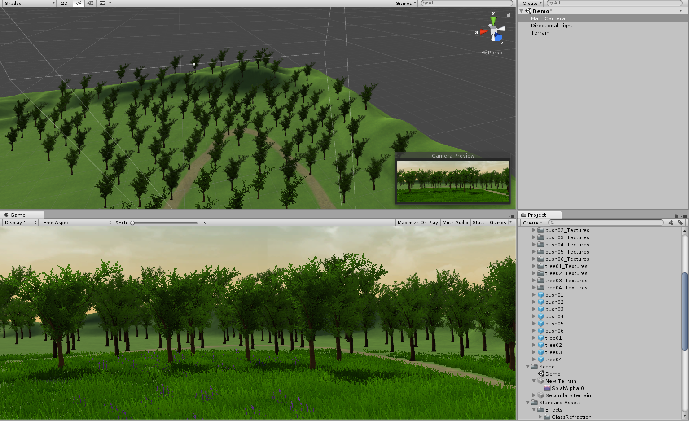
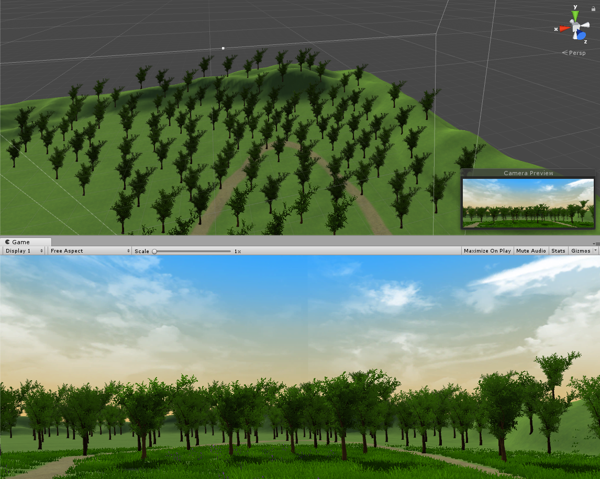

## 参考 Fantasy Skybox FREE 构建自己的游戏场景

## 游戏对象总结
游戏对象的基本属性有Active、Name、Tag、Layer等
- Active用于表示对象是否活跃，决定了是否触发OnUpdate以及渲染
- Name是对象的名称
- Tag是对象的标签
- Layer是对象所在的层次，取值为0～31

常用的游戏对象有
- Empty对象，可用于挂载脚本
- Camera摄像机，用于观察游戏世界
- Light光源，在游戏中提供光源
- 3D Object 3D对象，包含各类基本图形对象，如Cube、Sphere、Capsule、Plane、Quad、Cylinder等等
- Audio声音，提供音源

