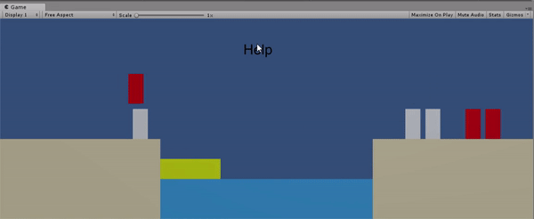
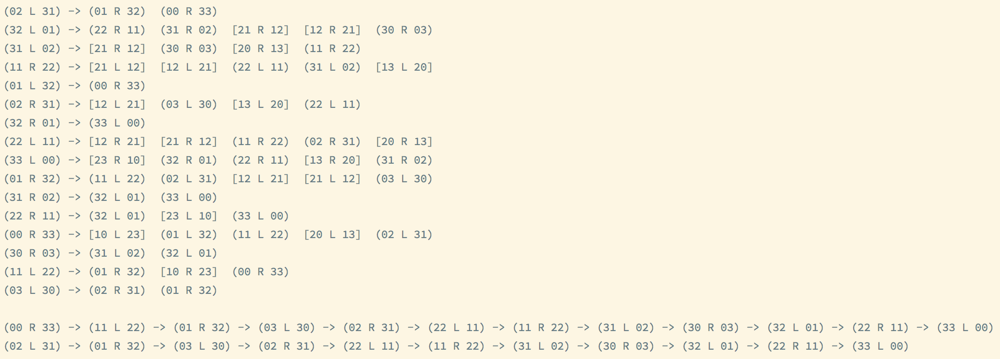

## 演示


## 终端测试及输出状态图
本文列举的代码里省去了一些用于便于在终端测试打印数据而重载的`Object.ToString()`方法，完整代码中经如下测试可得输出
```csharp
namespace PnDHelper.Test  
{  
  internal static class Program  
  {  
        private static void Main(string[] args)  
        {  
            var graph = new StatusGraph(3, 3);  
            Console.WriteLine(graph);  
              
            var node = graph.FindNodeByStatus(new[] {0, 0, 3, 3, 0});  
              
            while (node != null)  
            {  
                Console.Write(node.GetStatusPattern());  
                if (node.Next != null)  
                {  
                    Console.Write(" -> ");  
                }  
  
                node = node.Next;  
            }  
            Console.WriteLine();  
              
            node = graph.FindNodeByStatus(new[] {0, 2, 3, 1, 1});  
              
            while (node != null)  
            {  
                Console.Write(node.GetStatusPattern());  
                if (node.Next != null)  
                {  
                    Console.Write(" -> ");  
                }  
  
                node = node.Next;  
            }  
        }  
    }  
}
```
[]所括的节点表示非法节点（游戏已结束），()所括节点表示合法节点（游戏进行中）
`ab c de`中a表示左岸牧师数，b表示左岸恶魔数，c表示船的位置，d表示右岸牧师数，e表示右岸恶魔数


## 状态图的节点表示
主要记录该状态两岸角色个数以及船的位置
```csharp
public class StatusNode  
{  
    // The index for generating hashcode. Indicates the max count of character.  
    private const int MaxCount = 10;  
  
    private readonly int[] _left; // [0] for priest, [1] for devil  
    private readonly int[] _right;  
    private readonly bool _boatAtLeft;  
    public readonly List<StatusNode> Edges = new List<StatusNode>();  
  
    // Fields to be used when looking for shortest path.  
    public StatusNode Next { get; set; }  
    public int Distance { get; set; } = int.MaxValue;  
    public bool IsVisited { get; set; }  
  
    public StatusNode(int[] left, int[] right, bool boatAtLeft)  
    {  
        _left = left;  
        _right = right;  
        _boatAtLeft = boatAtLeft;  
    }  
  
    public static int CalculateStatusHashCode(int[] elements)  
    {  
        var hash = 0;  
        for (var i = 0; i < 5; i++)  
        {  
            hash += elements[i] * (int) Math.Pow(MaxCount, i);  
        }  
  
        return hash;  
    }  
  
    public StatusNode Transport(TransportAction action)  
    {  
        var newLeft = (int[]) _left.Clone();  
        var newRight = (int[]) _right.Clone();  
  
        newLeft[0] += (_boatAtLeft ? -1 : 1) * action.Priest;  
        newLeft[1] += (_boatAtLeft ? -1 : 1) * action.Devil;  
        newRight[0] += (_boatAtLeft ? 1 : -1) * action.Priest;  
        newRight[1] += (_boatAtLeft ? 1 : -1) * action.Devil;  
  
        var newNode = new StatusNode(newLeft, newRight, !_boatAtLeft);  
        return newLeft.Union(newRight).Any(e => e < 0) ? null : newNode;  
    }  
  
    public bool IsLegal()  
    {  
        return (_left[0] <= 0 || _left[1] <= _left[0]) && (_right[0] <= 0 || _right[1] <= _right[0]);  
    }  

	public TransportAction GetNextTransport()  
	{  
	    var priests = Math.Abs(Next._right[0] - _right[0]);  
	    var devils = Math.Abs(Next._right[1] - _right[1]);  
	    return new TransportAction(priests, devils);  
	}
	  
    // Override the Object.GetHashCode() method because we want two nodes with same status to be   
    // identical in hash-based collection as we are gonna store the nodes in collection in graph.  
    public override int GetHashCode()  
    {  
        int[] elements = {_left[0], _left[1], _right[0], _right[1], _boatAtLeft ? 1 : 0};  
        return CalculateStatusHashCode(elements);  
    }
}
```

## 状态图的存储
仅显示了存储节点及图数据的相关代码  
使用哈希表存储节点
```csharp
// Use hashtable for an efficient query.  
private readonly Hashtable _nodes = new Hashtable();  
private readonly int _priests;  
private readonly int _devils;  
  
public StatusGraph(int priests, int devils)  
{  
    _priests = priests;  
    _devils = devils;  
      
    InitGraph();  
    FindPath();  
}
```

## 状态图的生成
使用BFS生成所有可到达的状态并更新到图的节点数据中
```csharp
private void InitGraph()  
{  
    var nodeQueue = new Queue<StatusNode>();  
  
    // Initialize the status graph.  
    var srcNode = new StatusNode(new[] {0, 0}, new[] {_priests, _devils}, false);  
    _nodes.Add(srcNode.GetHashCode(), srcNode);  
  
    nodeQueue.Enqueue(srcNode);  
  
    var actions = new[]  
    {  
        new TransportAction(1, 0),  
        new TransportAction(0, 1),  
        new TransportAction(1, 1),  
        new TransportAction(2, 0),  
        new TransportAction(0, 2)  
    };  
  
    while (nodeQueue.Count > 0)  
    {  
        var currentNode = nodeQueue.Dequeue();  
  
        foreach (var action in actions)  
        {  
            var newNode = currentNode.Transport(action);  
  
            if (newNode == null)  
            {  
                continue;  
            }  
  
            // If the node is already added to graph, get the complete object of it.   
            // Because we need the information of its edges.  
            if (_nodes.Contains(newNode.GetHashCode()))  
            {  
                newNode = (StatusNode) _nodes[newNode.GetHashCode()];  
            }  
  
            currentNode.Edges.Add(newNode);  
  
            if (!_nodes.Contains(newNode.GetHashCode()) && newNode.IsLegal())  
            {  
                _nodes.Add(newNode.GetHashCode(), newNode);  
                nodeQueue.Enqueue(newNode);  
            }  
        }  
    }  
}
```

## 路径搜索
将终点作为源点进行BFS可得出各个节点到达终点的路径
```csharp
private void FindPath()  
{  
  var nodeQueue = new Queue<StatusNode>();  
  
    // Find the path from each node to destination with BFS.  
    var destNode =  
        (StatusNode) _nodes[StatusNode.CalculateStatusHashCode(new[] {_priests, _devils, 0, 0, 1})];  
    // There is no way to access destination.     
    if (destNode == null)  
    {  
        return;  
    }  
  
    destNode.Distance = 0;  
    nodeQueue.Enqueue(destNode);  
  
    while (nodeQueue.Count > 0)  
    {  
        var currentNode = nodeQueue.Dequeue();  
        currentNode.IsVisited = true;  
  
        foreach (var edge in currentNode.Edges)  
        {  
            if (edge.Distance <= currentNode.Distance + 1)  
            {  
                continue;  
            }  
  
            edge.Next = currentNode;  
            edge.Distance = currentNode.Distance + 1;  
            if (!edge.IsVisited && edge.IsLegal())  
            {  
                nodeQueue.Enqueue(edge);  
            }  
        }  
    }  
}
```

## 游戏内控制部分的代码
```csharp
// in file: Interface/ISceneAction.cs
public interface ISceneAction
{
    void BoatGo();
    void CharacterMove(GameObject character);
    void StartGame();
    void Help();
}


// in file: Controller/MainController.cs
public void Help()
{
    if (_isBusy)
    {
        return;
    }
    _isBusy = true;
    
    var left = _leftBank.transform.GetComponentsInChildren<Transform>();
    var right = _rightBank.transform.GetComponentsInChildren<Transform>();
    var node = _graph.FindNodeByStatus(new[]
        {
            CountCharacter(left, CharacterType.Priest),
            CountCharacter(left, CharacterType.Devil),
            CountCharacter(right, CharacterType.Priest),
            CountCharacter(right, CharacterType.Devil),
            _boatAtLeft ? 1 : 0
        }
    );
    if (node == null)
    {
        _isBusy = false;
        return;
    }
    var transport = node.GetNextTransport();
    StartCoroutine(AutoCharacterMoveCoroutine(transport));
}

private IEnumerator AutoCharacterMoveCoroutine(StatusGraph.TransportAction transport)
{
    var priest = transport.Priest;
    var devil = transport.Devil;
    var currentBank = _boatAtLeft ? _leftBank : _rightBank;
    var currentBankTransform = currentBank.transform;
    
    while (priest > 0)
    {
        var character = currentBankTransform.GetComponentsInChildren<Transform>()
            .First(e => CheckType(e.gameObject, CharacterType.Priest));
        yield return StartCoroutine(CharacterMoveCoroutine(character.gameObject));
        priest--;
    }

    while (devil > 0)
    {
        var character = currentBankTransform.GetComponentsInChildren<Transform>()
            .First(e => CheckType(e.gameObject, CharacterType.Devil));
        yield return StartCoroutine(CharacterMoveCoroutine(character.gameObject));
        devil--;
    }

    yield return StartCoroutine(BoatGoCoroutine());
    
    CheckGameCondition();

    if (_isBusy)
    {
        yield break;
    }
    
    foreach (var character in _boat.transform.GetComponentsInChildren<Transform>())
    {
        yield return StartCoroutine(CharacterMoveCoroutine(character.gameObject));
    }

    _isBusy = false;
}
```

## 总结
算法核心是两个BFS，一个BFS用于生成给定参数可达到的所有状态，其实只用到3牧师3恶魔的情况，但是由于是算法生成状态，动态的数量并不会产生额外的工作量，就写了动态的。另一个BFS从终点开始寻找到达各个节点的最短路径。此外使用哈希表加快查询。
在应用到游戏中的时候，其实可以用图中的节点来表示游戏状态，包括游戏结束状态的查询，但是涉及到的代码比较多，保险起见未曾对之前的代码进行重构。
Unity默认支持的dotNET版本比较低，在游戏中实际应用时对代码中使用语言特性的地方做出了一些修改，详情可见代码。